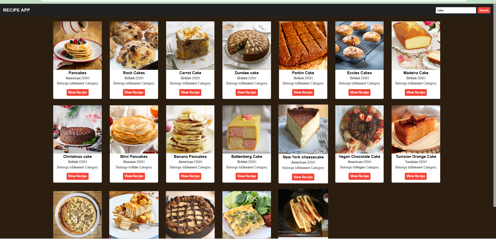

# 🍽️ Recipe App
A beginner-friendly recipe search application built with **HTML**, **CSS**, and **JavaScript**. It allows users to search for recipes, view ingredients, and read step-by-step cooking instructions.

## 📸 Screenshot

> 
> Example:  
> 

---

## 🚀 Features

- 🔍 Search recipes by name
- 📋 View ingredients and cooking instructions
- ❌ Close recipe popup
- 🔄 Loads default recipes on page load
- 🧠 Beginner-friendly JavaScript code

---

## 🛠 Tech Stack

- HTML5
- CSS3
- JavaScript (Vanilla)
- [TheMealDB API](https://www.themealdb.com/api.php)

---