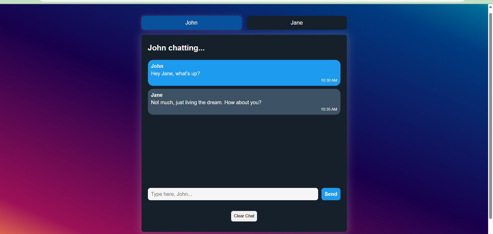

# 💬 Chat App

A simple and interactive chat interface built using **HTML**, **CSS**, and **JavaScript**. This app allows users to switch between two people (John & Jane), send messages, and view chat history. Messages are saved in the browser using `localStorage`.

---

## 🚀 Live Demo

👉 [View Chat App Online](https://chatapp-skybase.netlify.app/)

> 

---

## 📸 Screenshot

>  
> 

---
## 🧠 Features

- 👥 Switch between John and Jane as chat participants
- 💬 Send messages with real-time display
- 🕒 Auto-generated timestamps
- 💾 Chat history saved in browser with `localStorage`
- 🧹 Clear all messages with one click
- 🎨 Clean and modern UI design

---

## 🛠 Tech Stack

- HTML5
- CSS3 (Flexbox, gradient backgrounds, buttons)
- JavaScript (Vanilla)
- `localStorage` Web API

---

## ✍️ What I Learned

- Switching UI states with JavaScript
- Working with DOM methods (`querySelector`, `addEventListener`)
- Form handling and input validation
- Saving data in browser using `localStorage`
- Creating dynamic HTML content with JS

---