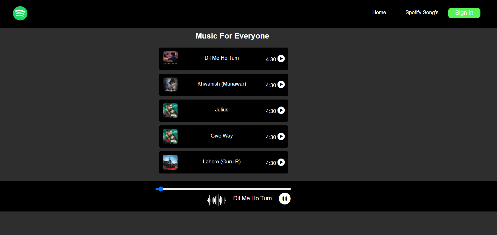

# 🎵 Spotify Clone (Vanilla JS)

A beginner-friendly Spotify-inspired music player built using **HTML**, **CSS**, and **JavaScript**. This clone allows users to:

- View a list of songs with thumbnails
- Play/pause songs
- See live song progress
- Control playback using a progress bar

---

## 📸 Screenshot

> Example interface:  
>   
> 

---

## 🚀 Live Demo

Check out the live version of the project here:  
👉 [spotify live demo](https://melofy-app.netlify.app/)

---

## 🔥 Features

- 🎧 Play/Pause music
- 📃 Display currently playing song
- 🎚️ Interactive progress seek bar
- 🟢 Realistic Spotify-style layout
- 🧠 Pure Vanilla JavaScript logic (no libraries)

---

## 🛠 Tech Stack

- HTML5
- CSS3
- JavaScript (Vanilla)

---
